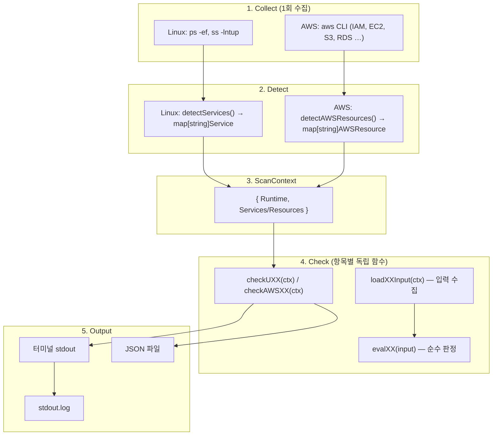

# auto-vulnerabilites-assessment-tool-ISMS

ISMS·주요정보통신기반시설(주통기) 및 SK Shieldus 클라우드 보안 가이드를 기준으로, 서버·클라우드 환경의 취약점을 자동·반자동 점검하는 도구 모음입니다.

Linux(U-01~U-67)와 AWS(AWS-01~AWS-63)는 Go 단일 바이너리로 자동 점검하며, Windows는 PowerShell 스크립트로 수동 점검을 보조합니다.

---

## 목차

- [전체 폴더 구조](#전체-폴더-구조)
- [아키텍처 개요](#아키텍처-개요)
- [플랫폼별 모듈](#플랫폼별-모듈)
- [공통 설계 패턴](#공통-설계-패턴)
- [점검 결과 형식](#점검-결과-형식)
- [빠른 시작](#빠른-시작)
- [점검 가이드 문서](#점검-가이드-문서)
- [개발 가이드](#개발-가이드)
- [상세 문서](#상세-문서)

---

## 전체 폴더 구조

```text
auto-vulnerabilites-assessment-tool-ISMS/
├── README.md                          # 프로젝트 개요 (이 문서)
│
├── guide/                             # 점검 기준 원문·참고 문서
│   ├── 주통기/
│   │   ├── 주통기_linux.md
│   │   ├── 주통기_windows.md
│   │   ├── 주통기_network.md
│   │   └── 주통기_database.md
│   └── SK쉴더스/
│       ├── SK_AWS.md
│       └── AWS_클라우드_보안_취약점_점검_기준_v2.1_서비스별_재구조화.md
│
└── scripts/                           # 실행 스크립트·점검기 소스
    ├── linux/                         # Linux 자동 점검 (Go, U-01~U-67)
    │   ├── main.go                    # 진입점, 결과 집계·출력
    │   ├── service.go                 # 런타임·서비스 감지
    │   ├── result.go                  # Status, CheckResult 타입
    │   ├── util.go                    # 파일 수집, 설정 파싱, 에러 처리
    │   ├── checkU01.go … checkU67.go  # 항목별 점검 로직
    │   ├── go.mod
    │   ├── README.md                  # Linux 상세 가이드
    │   ├── bin/
    │   │   └── linux-check            # 빌드 산출물 (gitignore 대상)
    │   ├── test-output/               # Docker 테스트 결과
    │   │   ├── vulnerable/
    │   │   └── secure/
    │   ├── vulnerableEnviorment/      # 취약 설정 Docker 테스트 환경
    │   │   ├── Dockerfile
    │   │   ├── docker-compose.yml
    │   │   └── entrypoint.sh
    │   └── sercureEnviormenet/        # 보안 설정 Docker 테스트 환경
    │       ├── Dockerfile
    │       ├── docker-compose.yml
    │       └── entrypoint.sh
    │
    ├── aws/                           # AWS 자동 점검 (Go, AWS-01~AWS-63)
    │   ├── main.go
    │   ├── service.go                 # AWS CLI 런타임·리소스 수집
    │   ├── result.go
    │   ├── util.go
    │   ├── checkAWS01.go … checkAWS63.go
    │   ├── go.mod
    │   └── README.md                  # AWS 상세 가이드
    │
    ├── windows.ps1                    # Windows 수동 점검 보조 (W-XX)
    └── linux.sh                       # Linux 수동 점검 명령 모음 (레거시 참고용)
```

> 디렉터리명 `vulnerableEnviorment`, `sercureEnviormenet`는 기존 요청 기준의 오타를 그대로 유지합니다.

---

## 아키텍처 개요

모든 자동 점검기(Linux, AWS)는 **Collect → Detect → Check → Output** 4단계 파이프라인을 공유합니다.



### 설계 원칙

| 원칙 | 설명 |
|------|------|
| **1회 수집, N회 재사용** | `ps`/`ss` 또는 `aws` CLI 호출은 시작 시 한 번만 실행하고, 모든 check가 `ScanContext`를 공유합니다. |
| **항목별 파일 분리** | 각 점검 항목은 `checkUXX.go` / `checkAWSXX.go` 단일 파일로 관리합니다. |
| **3단 함수 구조** | `checkXX` → `loadXXInput` → `evalXX`로 입력 수집과 판정 로직을 분리합니다. |
| **Graceful degradation** | 파일 일부 읽기 실패 시에도 점검 가능한 데이터로 계속 진행하고, 오류는 `ErrMsg`에 누적합니다. |
| **표준화된 결과** | 모든 check는 동일한 `CheckResult` 구조체와 `Status` enum을 반환합니다. |

---

## 플랫폼별 모듈

| 모듈 | 경로 | 점검 항목 | 실행 환경 | 자동화 수준 |
|------|------|-----------|-----------|-------------|
| **Linux** | `scripts/linux/` | U-01 ~ U-67 | Linux 서버 / Docker 테스트 | 자동 (Go) |
| **AWS** | `scripts/aws/` | AWS-01 ~ AWS-63 | AWS CLI 자격 증명 필요 | 자동 (Go, 일부 stub) |
| **Windows** | `scripts/windows.ps1` | W-01 ~ W-64 등 | Windows PowerShell | 수동 보조 |
| **Linux (레거시)** | `scripts/linux.sh` | U-01 ~ U-72 | Linux 셸 | 수동 명령 모음 |

### Linux (`scripts/linux/`)

- **기준**: 주통기 Linux 취약점 점검 항목 (U-01~U-67)
- **런타임 수집**: `ps -ef`, `ss -lntup`
- **서비스 감지**: SSH, FTP, Web, DNS, SNMP, NFS, RPC 등 20+ 서비스 카탈로그 (`service.go`)
- **출력 파일**: `<hostname>_<ip>.json`, `<hostname>_<ip>.stdout.log`
- **테스트**: Rocky Linux 9 기반 Docker 환경 (취약/보안 2종)

### AWS (`scripts/aws/`)

- **기준**: SK Shieldus 2024 클라우드 보안가이드 (AWS)
- **런타임 수집**: `aws` CLI (IAM, EC2, S3, RDS, CloudTrail, EKS 등)
- **가이드 매핑**: AWS-01~13 (계정), 14~16 (권한), 17~26 (가상 리소스), 27~41 (운영), 42~63 (예비/stub)
- **출력 파일**: `<accountId>_<region>.json`, `<accountId>_<region>.stdout.log`

### Windows (`scripts/windows.ps1`)

- **기준**: 주통기 Windows 취약점 점검 항목
- **역할**: 로컬 사용자, 패스워드 정책, 레지스트리, 서비스, 방화벽 등 점검에 필요한 명령을 순차 출력
- **자동 판정 없음**: 점검자가 출력 결과를 보고 수동 판정

---

## 공통 설계 패턴

### ScanContext

Linux와 AWS는 각각 플랫폼에 맞는 컨텍스트를 사용합니다.

```go
// Linux (service.go)
type ScanContext struct {
    Services map[string]Service
    Runtime  RuntimeData  // ProcessList, PortList
}

// AWS (service.go)
type ScanContext struct {
    Resources map[string]AWSResource
    Runtime   AWSRuntimeData  // IAMUsers, SecurityGroups, S3Buckets …
}
```

### check 함수 3단 구조

```go
func checkUXX(ctx ScanContext) CheckResult {
    const code = "U-XX"
    const description = "..."
    mitreAttack := MitreAttack{ ... }

    input, errs := loadUXXInput(ctx)   // 1. 입력 수집
    result := evalUXX(input)           // 2. 순수 판정
    result.Code = code
    result.Description = description
    result.MitreAttack = mitreAttack
    return resultWithErrors(result, errs)  // 3. 에러 누적 후 반환
}
```

| 함수 | 책임 |
|------|------|
| `checkXX(ctx)` | 메타데이터 설정, load/eval 연결 |
| `loadXXInput(ctx)` | 파일·서비스·런타임에서 입력 수집 |
| `evalXX(input)` | 설정값 기반 판정 (외부 I/O 최소화) |

### Status 판정 기준

| Status | 의미 | 사용 시점 |
|--------|------|-----------|
| `Good` | 양호 | 가이드 기준 충족 |
| `Vulnerable` | 취약 | 가이드 기준 미충족 |
| `Interview` | 인터뷰 | 자동 판정 어려움, 운영 정책 확인 필요 |
| `Manual` | 수동 | 자동화 불가, 점검자 직접 확인 |
| `Not Applicable` | 해당 없음 | 대상 서비스/파일 없음 |
| `Error` | 오류 | 입력 전혀 없어 점검 자체 불가 |

### CheckResult 필드

| 필드 | 설명 |
|------|------|
| `Code` | `U-01`, `AWS-01` 형식 |
| `GuideCode` | AWS 가이드 번호 (예: `1.1`) — AWS 전용 |
| `Description` | 점검 목적 한 줄 설명 |
| `Status` | 위 Status enum |
| `RawConfig` | 원본 설정 또는 명령 결과 |
| `ProcessedConfig` | 판정에 사용한 핵심 값 요약 |
| `VulnerableConfig` | 취약 시 근거·문제점 |
| `ErrMsg` | 읽기/명령 실패 등 부가 오류 |
| `MitreAttack` | MITRE ATT&CK tactic/technique/mitigation |

---

## 점검 결과 형식

JSON 배열로 저장되며, 각 항목은 아래 구조를 따릅니다.

```json
[
  {
    "OS": "LINUX",
    "Item": 1,
    "Description": "SSH root login should be disabled...",
    "Status": 0,
    "RawConfig": "PermitRootLogin no\n...",
    "ProcessedConfig": "PermitRootLogin:no",
    "VulnerableConfig": "",
    "ErrMsg": "",
    "MitreAttack": {}
  }
]
```

| 필드 | Linux | AWS |
|------|-------|-----|
| `OS` | `"LINUX"` | `"AWS"` |
| `Item` | U 번호 (1~67) | AWS 번호 (1~63) |
| `GuideCode` | — | 가이드 절 번호 (예: `"1.1"`) |
| `Status` | 0=Good, 1=Vulnerable, … | 동일 |

---

## 빠른 시작

### Linux

```bash
# 빌드
cd scripts/linux
GOOS=linux GOARCH=$(go env GOARCH) go build -o bin/linux-check .

# 대상 서버에서 실행 (root 또는 sudo 권한 권장)
./bin/linux-check

# Docker 테스트 (취약 환경)
cd vulnerableEnviorment
docker compose run --build --rm linux-check-vulnerable
# 결과: scripts/linux/test-output/vulnerable/<hostname>_<ip>.json
```

### AWS

```bash
# 사전 준비: AWS CLI v2, aws configure 완료
cd scripts/aws
go build -o bin/aws-check .
./bin/aws-check
# 결과: <accountId>_<region>.json
```

### Windows

```powershell
# 관리자 PowerShell에서 실행
Set-ExecutionPolicy -Scope Process Bypass
.\scripts\windows.ps1
```

---

## 점검 가이드 문서

| 문서 | 용도 |
|------|------|
| `guide/주통기/주통기_linux.md` | Linux U 항목 판정 기준 |
| `guide/주통기/주통기_windows.md` | Windows W 항목 판정 기준 |
| `guide/주통기/주통기_network.md` | 네트워크 장비 점검 기준 |
| `guide/주통기/주통기_database.md` | DBMS 점검 기준 |
| `guide/SK쉴더스/SK_AWS.md` | AWS 점검 항목·판정 기준 |
| `guide/SK쉴더스/AWS_클라우드_보안_취약점_점검_기준_v2.1_서비스별_재구조화.md` | AWS v2.1 서비스별 재구조화 기준 |

---

## 개발 가이드

### 새 Linux 점검 항목 추가

1. `scripts/linux/checkUXX.go` 파일 생성 (기존 `checkU01.go` 패턴 따름)
2. 서비스 관련 점검이면 `service.go`의 서비스 카탈로그에 키워드/포트 추가
3. `main.go`의 `results` 슬라이스에 `checkUXX(ctx)` 등록
4. 검증:

```bash
cd scripts/linux
go build -o /dev/null .
go vet ./...
```

5. Docker 테스트 환경에서 취약/보안 결과 비교

### 새 AWS 점검 항목 추가

1. `scripts/aws/checkAWSXX.go` 파일 생성
2. AWS CLI 데이터가 필요하면 `service.go`의 `collectAWSRuntimeData()`에 수집 추가
3. `main.go`에 `checkAWSXX(ctx)` 등록
4. `guide/SK쉴더스/SK_AWS.md`의 판정 기준과 `GuideCode` 매핑 확인

### 코딩 규칙 요약

- **서비스 재사용**: check마다 `ps`/`ss`/`aws`를 반복 호출하지 말고 `ctx.Services` / `ctx.Runtime` 사용
- **에러 처리**: 부분 실패는 `ErrMsg`에 누적, `StatusError`는 점검 완전 불가 시에만
- **설정 파싱**: Linux는 `findConfigValue(raw, key)` 우선 사용
- **파일명·타입명**: `checkU01.go`, `U01Input`, `checkU01` / `loadU01Input` / `evalU01` 패턴 유지
- **포맷**: `gofmt` 적용 후 `go build`, `go vet` 실행

---

## 상세 문서

플랫폼별 실행 방법, Docker 테스트 환경 구성, 코딩 양식 전체는 아래 README를 참고하세요.

| 문서 | 내용 |
|------|------|
| [`scripts/linux/README.md`](scripts/linux/README.md) | Linux U-01~U-67 상세 가이드, Docker 테스트, 코딩 규칙 |
| [`scripts/aws/README.md`](scripts/aws/README.md) | AWS AWS-01~AWS-63 상세 가이드, CLI 요구사항, 가이드 매핑 |

---

## 사전 요구사항

| 구성요소 | Linux | AWS | Windows |
|----------|-------|-----|---------|
| Go 1.26+ | 빌드용 | 빌드·실행 | — |
| Docker + Compose v2 | 테스트용 | — | — |
| AWS CLI v2 | — | 실행 필수 | — |
| root/sudo | 대상 서버 실행 | — | 관리자 권한 권장 |

---

## 주의사항

- `scripts/linux/bin/linux-check`, `scripts/aws/bin/aws-check`는 빌드 산출물입니다. 소스 변경 후 재빌드가 필요합니다.
- Docker 테스트 환경(`vulnerableEnviorment`, `sercureEnviormenet`)은 **의도적으로 취약한 설정**을 포함합니다. 운영 서버에 사용하지 마세요.
- AWS 점검기 AWS-42~63은 가이드 미정의 예비 항목으로, 현재 stub 상태입니다.
- `scripts/linux.sh`는 자동화 이전 수동 점검 명령 모음이며, 실제 자동 점검은 `scripts/linux/` Go 프로그램을 사용하세요.
