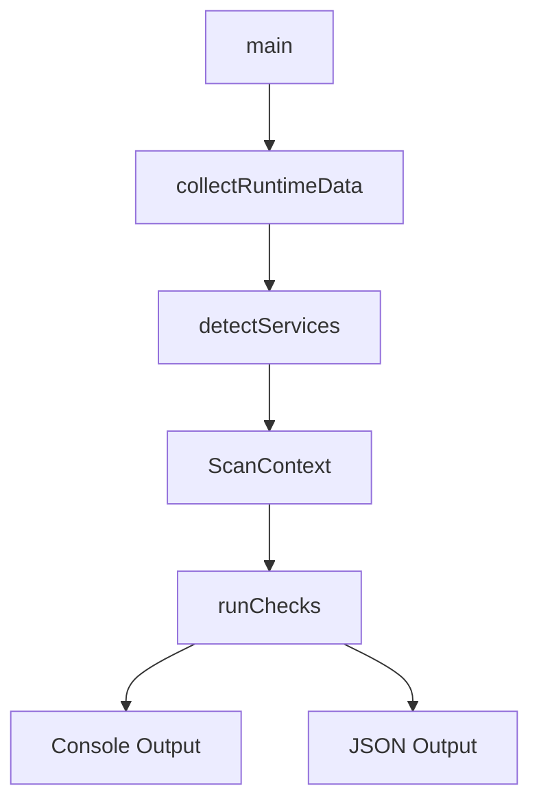

# AIX Vulnerability Check

이 폴더는 AIX U-01 ~ U-67 취약점 점검기를 위한 독립 Go 프로젝트입니다.

`checkU01.go` ~ `checkU67.go`가 구현되어 있으며 AIX 런타임, 서비스 상태 및 보안 설정을 수집해 전체 점검 결과를 출력합니다.

## 지원 범위

- 공식 Go `aix/ppc64` 포트 기준: AIX 7.2 이상, POWER8 이상
- AIX 7.1 이하: best-effort 대상이며 바이너리 실행을 보장하지 않음
- 64비트 big-endian PowerPC만 지원
- 정확한 계정·보안 파일 수집을 위해 root 권한 필요

## 폴더 구조

```text
scripts/aix/
├── main.go
├── service.go
├── util.go
├── result.go
├── checkU01.go ... checkU67.go
├── aix_u01_u13_test.go ... aix_u58_u67_test.go
├── service_test.go
├── util_test.go
├── go.mod
└── README.md
```

## 실행 구조



`collectRuntimeData()`는 다음 정보를 한 번만 수집합니다.

- `ps -ef`: 프로세스
- `netstat -an`: 리스닝 포트
- `lssrc -a`: SRC subsystem
- `/etc/inetd.conf`: inetd 서비스
- `oslevel -s`: AIX 버전

개별 점검은 같은 `ScanContext`를 재사용해야 하며 프로세스·포트를 반복 수집하지 않습니다.

## 주요 파일

| 파일 | 역할 |
|------|------|
| `main.go` | 실행 시작점, 콘솔/JSON 출력, 점검 함수 등록 |
| `service.go` | AIX 런타임, SRC, inetd, 서비스 감지 |
| `util.go` | 파일 수집, AIX stanza 파싱, 소유자 조회, 결과 유틸 |
| `result.go` | `CheckResult`, `Status`, `MitreAttack` 타입 |

## checkUXX 작성 규칙

Linux 프로젝트와 동일하게 수집과 판정을 분리합니다.

```go
type UXXInput struct {
    RawConfig string
}

func checkUXX(ctx ScanContext) CheckResult {
    const code = "U-XX"
    const description = "..."
    mitre := MitreAttack{
        Tactic:      "...",
        Techniques:  []string{"..."},
        Mitigations: []string{"..."},
    }

    input, errs := loadUXXInput(ctx)
    result := evalUXX(input)
    result.Code = code
    result.Description = description
    result.MitreAttack = mitre
    return resultWithErrors(result, errs)
}

func loadUXXInput(ctx ScanContext) (UXXInput, []string) {
    // AIX 파일, SRC, inetd 또는 ScanContext 입력 수집
}

func evalUXX(input UXXInput) CheckResult {
    // 외부 명령을 실행하지 않는 순수 판정
}
```

전체 점검은 `main.go`의 `runChecks()`에 U-01부터 U-67까지 순서대로 등록되어 있습니다.

## 안전 규칙

- 설정값이나 사용자 입력을 shell command 문자열에 연결하지 않습니다.
- 외부 명령은 `runProgram(name, args...)`로 argv를 분리해 실행합니다.
- `/etc/security/passwd`의 해시 원문을 `RawConfig`, JSON, stdout에 기록하지 않습니다.
- 설정을 읽지 못한 경우 빈 결과를 `Good`으로 처리하지 않고 `ErrMsg`, `Error`, `Interview`로 구분합니다.
- 결과 JSON과 stdout 로그는 `0600` 권한으로 생성합니다.

## 빌드

프로젝트 루트에서 AIX ppc64 실행파일을 교차 빌드합니다.

```bash
cd scripts/aix
GOOS=aix GOARCH=ppc64 CGO_ENABLED=0 go build -o bin/aix-check .
```

빌드 디렉터리가 없다면 먼저 생성합니다.

```bash
mkdir -p bin
```

## AIX에서 실행

```sh
chmod 700 aix-check
sudo ./aix-check
```

출력:

```text
<hostname>_<ip>.json
<hostname>_<ip>.stdout.log
```

두 파일 모두 민감한 진단 결과 보호를 위해 `0600`으로 생성됩니다.

## 개발 검증

```bash
cd scripts/aix
gofmt -w *.go
go test ./...
go vet ./...
GOOS=aix GOARCH=ppc64 CGO_ENABLED=0 go build -o /tmp/aix-check .
```

교차 빌드는 컴파일 가능성만 검증합니다. `lssrc`, `oslevel`, AIX 보안 stanza와 실제 서비스 결과는 AIX 테스트 호스트에서 별도로 검증해야 합니다.
